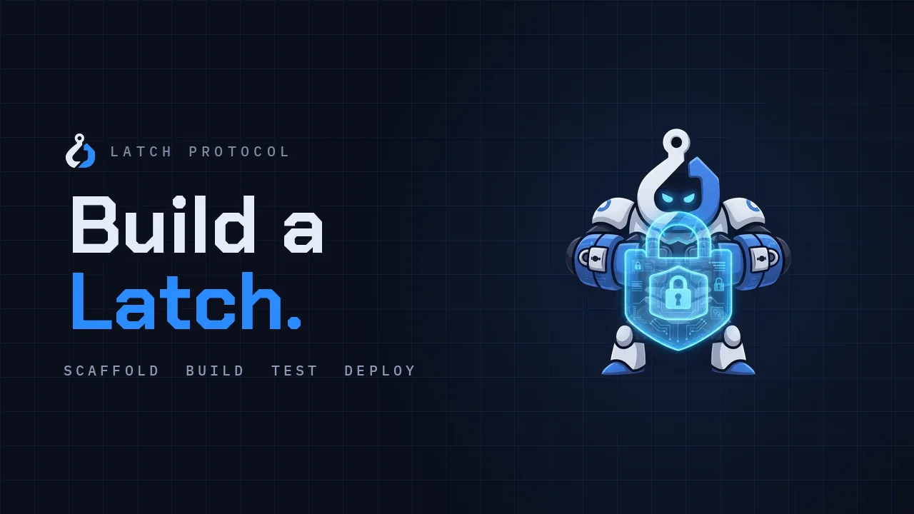

<p align="center">
  <a href="https://latches.fun">
    
  </a>
</p>

<h1 align="center">
  <picture>
    <source media="(prefers-color-scheme: dark)" srcset="assets/latch-lockup.png">
    
  </picture>
</h1>

<p align="center"><strong>The contracts a Latch is built against.</strong><br>
A Latch is a hook contract attached to a pool on Latch Protocol's core. This repository is what yours compiles against.</p>

<p align="center">
  <a href="https://latches.fun">Site</a> ·
  <a href="https://docs.latches.fun">Docs</a> ·
  <a href="https://testnet.latches.fun/app">Try the app</a> ·
  <a href="https://latches.fun/ecosystem">Ecosystem</a> ·
  <a href="https://github.com/Latch-Protocol-Team/latch-sdk">SDK</a> ·
  <a href="https://github.com/Latch-Protocol-Team/dex-tokenl-list">Token list</a> ·
  <a href="https://blog.latches.fun">Blog</a>
</p>

<p align="center">
  <a href="https://x.com/Latchesdotfun">X</a> ·
  <a href="https://t.me/latchprotocol">Telegram</a> ·
  <a href="https://t.me/LatchDeploys">Launch alerts</a>
</p>

<p align="center">
  <b>Building with a coding agent?</b> Start with a prompt, not the docs:<br>
  <a href="prompts/build-a-latch.md">Build a Latch with Claude</a> &nbsp;·&nbsp;
  <a href="AGENTS.md">The rules an agent follows</a>
</p>

---

## Start in one command

You need [Foundry](https://getfoundry.sh) (`forge`, `anvil`), git and Node 20 or newer.

```bash
npx @latchprotocol/create-hook my-latch --template dynamic-fee
cd my-latch
forge test -vv
```

The scaffolder writes a Foundry project with your Latch, a test and a deploy script. It fetches
this repository into `lib/latch-contracts` at a commit it pins and checks, so the contracts you
test against are the contracts that are deployed. The project builds and passes its tests on the
first run.

| Template | What it is |
|---|---|
| `noop` | The smallest Latch that builds, deploys and backs a live pool. A starting point |
| `dynamic-fee` | Sets the pool's fee per swap, priced off the swap's size |
| `swap-counter` | Keeps a count of swaps per pool on chain: the shape of a Latch that holds state |

Prefer to wire it yourself? Add this repository to a Foundry project as a submodule:

```bash
git submodule add https://github.com/Latch-Protocol-Team/latch-contracts lib/latch-contracts
git -C lib/latch-contracts submodule update --init --recursive
```

## Build it with Claude

| File | What it is for |
|---|---|
| [`prompts/build-a-latch.md`](prompts/build-a-latch.md) | A prompt to paste into [Claude Code](https://claude.com/claude-code): describe your Latch in five lines and it designs, writes, tests and reviews it |
| [`AGENTS.md`](AGENTS.md) | The facts about the core and the rules a Latch lives by, written for coding agents |
| `CLAUDE.md` in your project | The scaffolder writes one into every project it makes, with that project's own bitmap and parameters, so Claude Code follows the rules without being told |

An agent's review is a first pass, not an audit. Have a Latch that holds money reviewed by
somebody who did not write it.

## What is here

| Path | What it is |
|---|---|
| `packages/core/src` | The settlement layer: `Vault`, the concentrated-liquidity and bin pool managers, libraries and types |
| `packages/core/test` | Its tests, and the test routers your own tests can import |
| `packages/core/lib` | `forge-std`, `openzeppelin-contracts` and `solmate`, as git submodules |
| `packages/hooks/src/base` | `BaseCLHook` and `BaseBinHook`: what a Latch extends |

## What a Latch can do

A Latch declares which moments of a pool's life it takes part in, and the pool manager calls it
at those moments and no others.

| Moment | What a Latch can do there |
|---|---|
| Before and after a pool is created | Accept or refuse the pool, record its terms |
| Before and after liquidity is added or removed | Gate who provides liquidity, keep its own accounting |
| Before a swap | Gate the trade, set the pool's fee for it |
| After a swap | Record it, take a share of it as a fee |
| Before and after a donation | Accept or refuse it |

Latch Protocol's own Latches are built the same way: launch guards with a decaying anti-snipe
fee, a creator tax that expires by itself, revenue share, market hours and price bands for
tokenised stocks, and permissioned pools.

## Rules a Latch lives by

- **A Latch's address is part of its pool's identity.** A pool names its Latch in its key, so a
  Latch cannot be upgraded or swapped: a new version means new pools.
- **A Latch works from any address.** Its permissions come from
  `getHooksRegistrationBitmap()`, which the pool manager checks against the pool key's
  `parameters` when the pool is created. There is no address to mine.
- **A Latch acts only on pools that name it**, and only inside the callbacks its bitmap declares.
- **Fee-on-transfer and rebasing tokens are not supported** by the Vault's accounting.
- **Test under the profile of the chain you deploy to.**

## Two build profiles

Chains with EIP-1153 use transient storage; chains without it use a storage backend with the
same interface. One source, two profiles:

```bash
forge build                          # default: EIP-1153, evm_version cancun
FOUNDRY_PROFILE=legacy forge build   # legacy:  storage backend, evm_version shanghai
```

## How Latch Protocol works

- **One shared core per chain.** A vault, a concentrated-liquidity pool manager and a bin pool
  manager, deployed once and verified once. You deploy a Latch against it, never the core.
- **Every pool lives in the same two managers**, so one integration per chain covers every
  Launchpad, DEX and Latch built on it.
- **Revenue is enforced by contracts, never by SDK code.** Caps are immutable, a launch's terms
  are frozen when it is created, and no key anywhere can move a user's funds.
- **Admin keys that cannot hurt you.** Immutable contracts, two-step ownership with
  `renounceOwnership` disabled, and delays that scale with how hard an action is to undo.
- **Latch has no token.** The protocol earns from the fees its contracts enforce.

## Get listed


A Latch is listed in an on-chain registry with its permissions read from the contract itself,
so a trader can see exactly what sits in the swap path. Listing your Latch, Launchpad or DEX in
the ecosystem is an
[issue form](https://github.com/Latch-Protocol-Team/.github/issues/new/choose), and the listing
is read back from the chain before it is shown.

A listing is not an audit. It says what a Latch is permitted to do, not that it is safe.

## Repositories

| Repository | What it is | Licence |
|---|---|---|
| [`latch-contracts`](https://github.com/Latch-Protocol-Team/latch-contracts) | This repository: the core and the base contracts a Latch extends | GPL-2.0-or-later |
| [`latch-sdk`](https://github.com/Latch-Protocol-Team/latch-sdk) | TypeScript SDK: deployments, reads, launch building, market data, token lists | MIT |
| [`dex-tokenl-list`](https://github.com/Latch-Protocol-Team/dex-tokenl-list) | The Latch token list, in the standard Token Lists schema | MIT |

## Licence

GPL-2.0-or-later. `packages/core` is a derivative of
[pancakeswap/infinity-core](https://github.com/pancakeswap/infinity-core); see `NOTICE` for what
Latch changed. A contract that imports these sources is a derivative work under the same licence.
The SDK is MIT and talks to deployed contracts through their ABI. Latch Protocol runs only on its
own deployments and is not affiliated with any other protocol.

## This repository is published, not edited

It is written from Latch's source repository by a script. Open an issue here; a pull request
against these files would be overwritten by the next publication.

<p align="center">
  <picture>
    <source media="(prefers-color-scheme: dark)" srcset="assets/powered-by-latch-dark.png">
    
  </picture>
</p>
